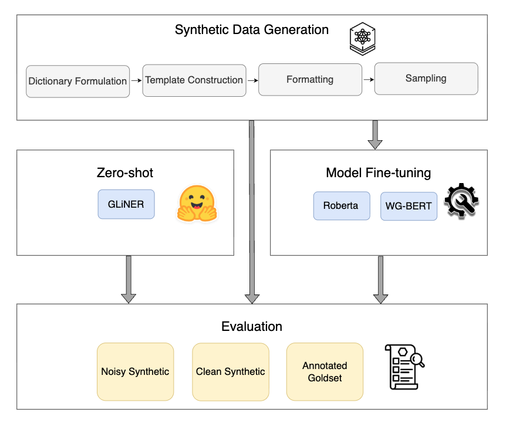

# Automotive NER: Fine-grained Entity Extraction from Service Reports

Official implementation and datasets for the paper:  
**"Extracting Fine-Grained Technical Entities from Unstructured Automotive Service Reports"**

---

## 📌 Project Overview
Automotive service reports are a goldmine for data-driven fault diagnosis, but they are notoriously difficult to process due to:

* **Domain Jargon**: Highly specialized technical terminology.
* **Low Resource**: Lack of publicly available labeled datasets.
* **Structural Variability**: A mix of structured Diagnostic Trouble Codes (DTCs) and unstructured technician notes.

*Figure 1: F1-Score comparison across WG-BERT, RoBERTa, and GLiNER.*
This repository provides a framework to bridge this gap using **template-based data synthesis** and **domain-adapted Transformer models** (WG-BERT, RoBERTa), evaluated against zero-shot baselines (GLiNER).

---

## 🏷️ Supported Entities
Our models are trained to recognize 10 fine-grained technical entities:
`VehicleMakeModel`, `FaultCode`, `CustomerReportedSymptom`, `VehicleComponentLocation`, `MaintenanceMethod`, `DeviceProperties`, `MeasurementValue`, `EquipmentName`, `FaultType`, and `TimeDuration`.

---

## 🛠️ Repository Structure
- `data/`: Contains `.conll` datasets (including `advarsarial.conll` for robustness testing).
- `notebooks/`:
    - `01_Synthesis.ipynb`: Logic for adversarial data generation and Label Studio conversion.
    - `02_Training.ipynb`: Fine-tuning scripts for **WG-BERT** and **RoBERTa-base**.
    - `03_Evaluation.ipynb`: Comparative analysis, F1-score plots, and GLiNER zero-shot testing.

---

@inproceedings{zafar2026zeroshot,
  title={From Zero-Shot to Domain Precision: Synthetic Data Fine-Tuning for Robust NER in Low-Resource Domain-Specific Texts},
  author={Zafar, Adeel and Nowaczyk, S{\l}awomir and Sarmadi, Hamid},
  booktitle={Foundations of Intelligent Systems: 28th International Symposium, ISMIS 2026, Industry Track},
  year={2026},
  address={Halmstad, Sweden},
  publisher={Springer},
  note={Accepted for publication}
}
